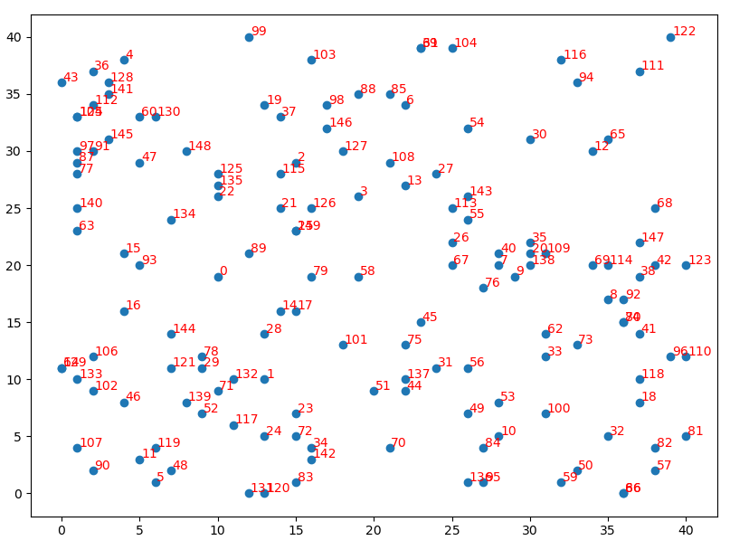
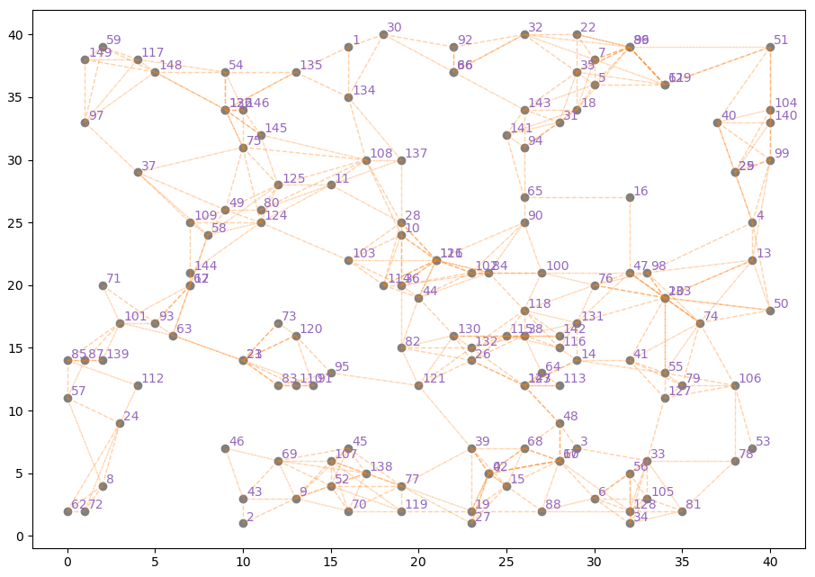
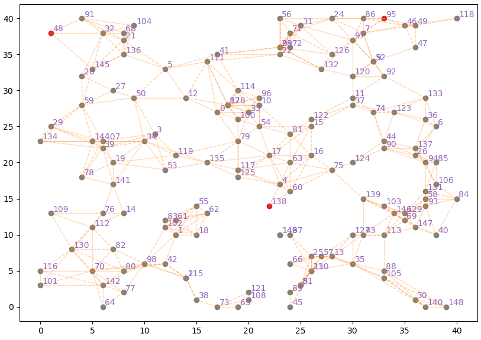
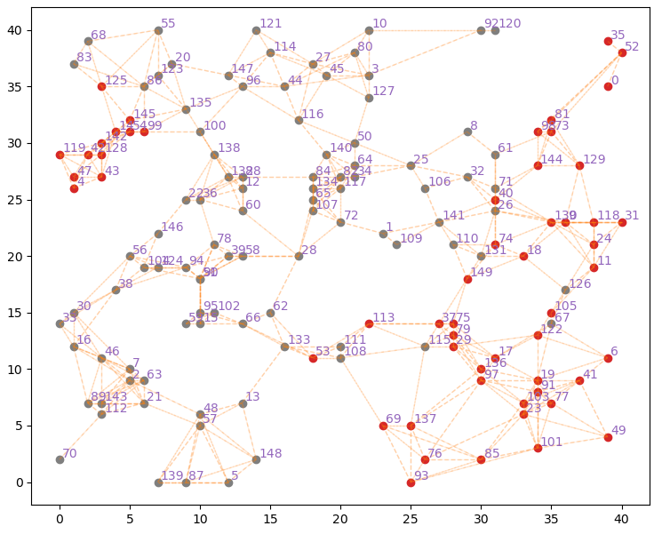
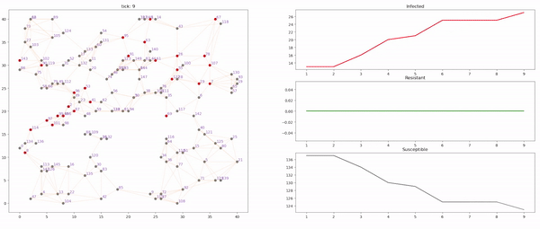

# How to convert an agent-based model from NetLogo to Python. 

...and other stuff that will help you avoid headaches. 

## What is this guide about?

In this guide we will take a model written in [NetLogo](https://ccl.northwestern.edu/netlogo/) and we will transform it into a Python model step by step.  We will take the [NetLogo Virus on a Network model](https://ccl.northwestern.edu/netlogo/models/VirusonaNetwork) developed by Stonedahl and Wilensky in 2008, as sample written in NetLogo. The model demonstrates the spread of a virus within a network, composed of nodes that can assume 3 states: **S**usceptible, **I**nfected, or **R**esistant (SIR). Infected nodes can transmit the virus to their neighbors, susceptible nodes can be infected and resistant nodes cannot contract the virus. This guide examines the Mesa package, a popular agent-based modeling framework written in Python. We wrote this guide trying to be as clear as possible and following the mantra of the popular subreddit eli5 (Explain Like I'm Five). The Python implementation of each procedure follows this outline:
1. What the code does in NetLogo
2. The explanation of the translation process step by step
3. The code translated into Python

In case you want to get straight to the point, in the models folder you will find model.py, the ready-made model. As much as we care about this guide, summarizing all the knowledge on the topic is quite complex, in some places we kept it simple. In case you notice some important point that has not been touched, the issue section is open.

## Index:
  * [NetLogo2Mesa](#netlogo2mesa)
    + [1. Create the blueprints](#1-create-the-blueprints)
    + [2. Enhance Core classes](#2-enhance-core-classes)
      - [Random](#random)
      - [Scheduler](#scheduler)
    + [3. Create the setup](#3-create-the-setup)
      - [setup-nodes](#setup-nodes)
      - [display the nodes in space](#display-the-nodes-in-space)
      - [setup-spatially-clustered-network](#setup-spatially-clustered-network)
      - [Complete setup](#complete-setup)
    + [4. Go!](#4-go)
      - [Stop the simulation if no infected nodes](#stop-the-simulation-if-no-infected-nodes)
      - [Update the testing clock](#update-the-testing-clock)
      - [Spread the virus!](#spread-the-virus)
      - [Make them resistant!](#make-them-resistant)
    + [Step 5, make it scientist-friendly](#step-5--make-it-scientist-friendly)
      - [utility functions](#utility-functions)
      - [save the data](#save-the-data)
      - [visualize it!](#visualize-it)
    + [Glosary](https://github.com/LABSS/NetLogo2Mesa/blob/master/Glossary.md)


## NetLogo2Mesa

### 1. Create the blueprints

At a high level of abstraction the model we are going to create can be defined as a single object, a python-class. We can call this class **VirusModel**. This object has its **attributes** such as the number of agents or nodes and its **methods**, the procedures specific to our model, such as the algorithm that generates the network. In Python each object has its own `__init__` method, this method is called every time a new **VirusModel** object is instantiated, it is good practice to define here all the attributes of our model (e.g. here is where we define all the variables that in NetLogo are under the name [globals](http://ccl.northwestern.edu/netlogo/docs/dict/globals.html)). The first attribute we define is `VirusModel.number_of_nodes` which simply represents the number of nodes. We don't want a fixed number of nodes so  insert as parameter of the `__init__` the keyword `number_of_nodes` specify the type `int`, and give it a default value of 150. In this way every time a new **VirusModel** object is instantiated we can define a number of nodes, if we don't do it `VirusModel.number_of_nodes` will be equal to default value.  Now it's time to introduce the global attributes, including those that in NetLogo are stored in the graphical interface, and give them a default value. These are: `gain-resistance-chance`, `recovery-chance`, `virus-spread-chance`, `virus-check-frequency`, `initial-outbreak-size`, `average-node-degree`. We also define the size of the graphic space. In NetLogo this information is contained in the Interface section or by opening the .nlogo file with a text editor in the `GRAPHICS-WINDOW` section. From here we can see that the width of the space goes from -20 to 20 and the height from -20 to 20, in Python for simplicity we will say that the `VirusModel.space_width = 40` and `VirusModel.space_heigh = 40`. So our space will go from 0 to 40 in the x-axis and y-axis. We want a model that has style, so we name our model object using the special `__repr__` method, every time we print an instance of  **VirusModel** this method is called. 

```python
class VirusModel():

    def __init__(self, number_of_nodes = 150):
        self.number_of_nodes = number_of_nodes
        self.space_width = 40
        self.space_height = 40
        self.gain_resistence_chance = 5.0
        self.recovery_chance = 5.0
        self.virus_spread_chance: 2.5
        self.virus_check_frequency = 1
        self.initial_outbreak_size = 3
        self.average_node_degree = 6


    def __repr__(self):
        return "Virus Model"
```

We have our simple **VirusModel**, now it is time to create nodes, the agents of our model. Create the Node class and define the special `__init__` method, here we will insert the attributes of each agent. The attributes of agents in a NetLogo model are contained within the primitive turtle-related `<breeds>-own`. In the example model nodes have these properties: 

```
turtles-own
[
  infected?           ;; if true, the turtle is infectious
  resistant?          ;; if true, the turtle can't be infected
  virus-check-timer   ;; number of ticks since this turtle's last virus-check
]
```

Insert these attributes inside the `__init__` method and give it a default value. At this point, however, we want every single node to be able to access the attributes of the **VirusModel**. To do this, we add a new parameter to the `__init__` method, `model`, and create a `Node.model` attribute. Through this attribute it will be possible to access the properties of the already instantiated model. We also want each Node to stand out from the others. For this reason we pass to the `__init__` another parameter, `Node.unique_id`, a number that describes the single node. Each node will have its position on a plane, defined with two x and y coordinates, for now we will give it 0 as default parameter. And since we have style, we give a name to each Node, something like: " Node: 1" could be fine. Our blueprint is ready. 

```python
class Node():

    def __init__(self, model, unique_id):
        self.model = model
        self.unique_id = unique_id
        self.x = 0
        self.y = 0
        self.infected = False
        self.resistant = False
        self.virus_check_timer = 0


    def __repr__(self):
        return "Node: " + str(self.unique_id)
```

The script up to this point should look something like this.

```python
class VirusModel():

    def __init__(self, number_of_nodes = 150):
        self.number_of_nodes = number_of_nodes
        self.space_width = 40
        self.space_height = 40
        self.gain_resistence_chance = 5.0
        self.recovery_chance = 5.0
        self.virus_spread_chance: 2.5
        self.virus_check_frequency = 1
        self.initial_outbreak_size = 3
        self.average_node_degree = 6

    def __repr__(self):
        return "Virus Model"
        
class Node():

    def __init__(self, model, unique_id):
        self.model = model
        self.unique_id = unique_id
        self.x = 0
        self.y = 0
        self.infected = False
        self.resistant = False
        self.virus_check_timer = 0

    def __repr__(self):
        return "Node: " + str(self.unique_id)
```


### 2. Enhance Core classes

Before we go to write the procedures of our model and our agents, we must have a machine that has the necessary functionality. The Mesa package gives us some interesting tools to enhance our model, which otherwise were to be implemented from scratch. The [two basic Mesa modules](https://mesa.readthedocs.io/en/master/apis/init.html) are mesa.agent and mesa.model, these modules give us the basic mesa.model.Model and mesa.agent.Agent classes. These two classes, have their methods and attributes that we want to implement within our VirusModel (our model) and Node (our agents). In Python this mechanism is implementable through inheritance, when we create a new class, passing as parameter an existing class, the new class will inherit all methods and attributes. 

```python
from mesa.model import Model
from mesa.agent import Agent

class VirusModel(Model):
	def __init__(self, number_of_nodes = 150):
        
        
class Node(Agent):
    def __init__(self, model, unique_id):
        super().__init__(unique_id, model)
```

The `super().__init__(parameters)` function also allows you to inherit the parameters of the superclass `__init__`. On an abstract level you can imagine that VirusModel is the child of the mesa.model.Model class. In order to better understand how this mechanism works I suggest to have a look inside [mesa.agent](https://github.com/projectmesa/mesa/blob/master/mesa/agent.py) and [mesa.model](https://github.com/projectmesa/mesa/blob/master/mesa/model.py).

#### Random

The mesa.model.Model class gives us a fundamental functionality for an ABM: a random generator. When we instantiate a VirusModel object the Pyhton interpreter executes the special `__new__` method of the mesa.model.Model class, this method instantiates for us a [random.Random](https://docs.python.org/3/library/random.html) object, and since the child class inherits all the attributes of the parent class, we can access this attribute from the VirusModel object. You can test this generator by simply instantiating a VirusModel object, accessing the random attribute and then the random.Random.random() method, this method will return a random float between 0 and 1.

```python
if __name__ == "__main__":
    model = VirusModel()
    print(model.random.random())
```

The built-in random module offers many options and for a basic model like our example should be enough. But if you want a more complete random generator you have to use [numpy.random.default_rng](https://numpy.org/doc/stable/reference/random/generator.html#numpy.random.default_rng). 

How do we implement it? Easy, first thing first import the module `from numpy.random import default_rng`, then we add an attribute to the VirusModel class `self.random = default_rng()` this will be our random generator. In this way we override the random attribute of the Model base class of Mesa. We also need to make sure that the random generator has a seed that makes the results of different simulations reproducible. We expect the following two behaviors when creating a new VirusModel instance

1. By passing a seed as a parameter to VirusModel's init, numpy.random.default_rng() must use that seed.
2. If no seed is passed, the model must generate one, save it and use that seed for the numpy.random.default_rng() instance.

To do this we add a new parameter, `seed`, to the __init__ of VirusModel. In order to implement behavior number 2, this parameter must take on a default value. We can use the os library and in particular the os.urandom() function to extract a string of bytes from our system. This function takes as parameter an integer, which represents the number of bytes of the string that is generated, 8 is more than enough. Also since it is a string of bytes we have to transform it into an integer using the sys library. 

```python
import os
import sys
import numpy as np

class VirusModel(Model):

    def __init__(self, number_of_nodes=150, seed=int.from_bytes(os.urandom(8), sys.byteorder)):
        self.seed = seed
        self.random = default_rng(self.seed)
```

If we want to reproduce two identical simulations we will just use the same seed, moreover if we do not provide a seed our model will generate a pseudo-random seed that we can access to replicate the simulation. Fantastic, isn't it?

#### Scheduler

When we create our Nodes we would need a place to store them. To solve this problem the Mesa package offers us the mesa.time module.
This module offers 3 classes that we have to choose according to our modeling needs, we will not go into detail as they are perfectly explained on the [mesa.time module documentation.](https://mesa.readthedocs.io/en/master/apis/time.html) 

For our model we will use the class mesa.time.RandomActivation, the scheduler of this class activates agents randomly for each step, in short it clones the [ask primitive of NetLogo](http://ccl.northwestern.edu/netlogo/docs/dict/ask.html). Let's start implementing the scheduler, the first step is to import RandomActivation from the mesa.time module. 

```
from mesa.time import RandomActivation
```

Then we create a new VirusModel attribute that will be an instance of the RandomActivation class.

```
self.schedule = RandomActivation(self)
```

This object will manage the list of our nodes, every time we create a new node we will add it to scheduler with the `self.schedule.add(Node)` method, in the same way every time we want to delete an agent we will extract it with the `self.schedule.remove(Node)` method.

```python
from mesa.model import Model
from mesa.agent import Agent
from mesa.time import RandomActivation
from numpy.random import default_rng
import time


class VirusModel(Model):

    def __init__(self, number_of_nodes=150, seed=int.from_bytes(os.urandom(8), sys.byteorder)):
        super().__init__(seed=seed)
        self.seed = seed
        self.tick = 0
        self.space_width = 40
        self.space_height = 40
        self.rng = default_rng(self.seed)
        self.schedule = RandomActivation(self)
        self.number_of_nodes = number_of_nodes
        self.gain_resistence_chance = 5.0
        self.recovery_chance = 5.0
        self.virus_spread_chance: 2.5
        self.virus_check_frequency = 1
        self.initial_outbreak_size = 3
        self.average_node_degree = 6
    


    def __repr__(self):
        return "Virus Model"


class Node(Agent):

    def __init__(self, model, unique_id):
        super().__init__(unique_id, model)
        self.model = model
        self.unique_id = unique_id
        self.x = 0
        self.y = 0
        self.infected = False
        self.resistant = False
        self.virus_check_timer = 0


    def __repr__(self):
        return "Node: " + str(self.unique_id)


if __name__ == "__main__":
    model = VirusModel()
    node = Node(model, 1)
```


### 3. Create the setup

Now that we have our blueprint, it is time to implement the procedures that organize the initial status of the model or simply everything that in NetLogo is included in the "setup" procedure. 

##### What does the Virus on a network Model setup do?

The setup starts by generating all the necessary nodes (number-of-nodes) and gives it 3 fundamental properties: a position on space (defined by an x and y), an initial state (S) and a value for virus-check-timer. If we visualize our space at this point we will see many points stochastically positioned on a space.
The next step is to join these points creating a network. The algorithm that performs this process is very simple, it defines a maximum number of nodes that depends on average-node-degree and number-of-nodes, starts a cycle of iterations continues as long as the total number of links is lower than the maximum number of links. Each iteration, a random node is taken and linked to another node nearby, as long as these two do not already have a link. Finally, a number of nodes equal to initial-outbreak-size is set to infected.

We will analyze and translate into Python procedure by procedure:

```NetLogo
to setup
  clear-all
  setup-nodes
  setup-spatially-clustered-network
  ask n-of initial-outbreak-size turtles
    [ become-infected ]
  ask links [ set color white ]
  reset-ticks
end
```

#### setup-nodes

Let's skip the primitive [clear-all](http://ccl.northwestern.edu/netlogo/docs/dict/clear-all.html). In Python we don't need this, simply every time we want to create a new model we create another instance of VirusModel.

The  procedure setup-nodes defines a default form for all agents, a circle, then generates as many agents as required by the number-of-nodes parameter and assigns to each one an x value and a random y value on a plane activates the become-susceptible procedure and assigns a random value to the virus-check-timer attribute.

```
to setup-nodes
  set-default-shape turtles "circle"
  create-turtles number-of-nodes
  [
    setxy (random-xcor * 0.95) (random-ycor * 0.95)
    become-susceptible
    set virus-check-timer random virus-check-frequency
  ]
end
```

In NetLogo the primitive [create-turtles number [ commands ]](http://ccl.northwestern.edu/netlogo/docs/dict/create-turtles.html) does nothing but create number agents and immediately execute the commands. In Python we can emulate this behavior with a simple `for` cycle. Inside the model, we define a new setup-nodes method and implement a simple `for` loop using the built-in range(number_of_nodes) function so the loop will do as many iterations as number_of_nodes. For each cycle we instantiate a new node, pass it the model and iteration number (this parameter will assign a unique_id to the single node based on the iteration number) as parameters and add the node to the scheduler. 

```python
def setup_nodes(self):
    for id in range(self.number_of_nodes):
        new_node = Node(model=self, unique_id=id)
        self.schedule.agents.add(new_node)

def setup(self):
	self.setup_nodes()
```

Remember that every time a new Node is instantiated the special `__init__` method is executed, this means that we can specify the initial properties of each Node within the `__init__` of the Node and not within setup_nodes. To define the random coordinates of each node we just use the default_rng instance we created inside the model and called VirusModel.random; the [numpy.random.default_rng.integers](https://numpy.org/doc/stable/reference/random/generated/numpy.random.Generator.integers.html#numpy.random.Generator.integers) function returns an integer in a given range in this case we want an integer from 0 to VirusModel.space_width for the x and from 0 to VirusModel.space_height for the y. We have our random coordinates for each Node, now we give it an initial state, defined in NetLogo by the become-susceptible procedure that simply sets infected to False and resistant to False. and finally we set a virus-check-timer represented by a integer random from 0 to virus-check-frequency. 

```python
class Node(Agent):

    def __init__(self, model, unique_id):
        super().__init__(unique_id, model)
        self.model = model
        self.unique_id = unique_id
        self.x = self.model.rng.integers(0, self.model.space_width)
        self.y = self.model.rng.integers(0, self.model.space_height)
        self.infected = False
        self.resistant = False
        self.virus_check_timer = self.model.rng.integers(0, self.model.virus_check_frequency)
```

#### display the nodes in space

In case you are short of motivation, seeing something graphic might cheer you up. For this visualization we will use matplolib, first thing then import the package. 

```python
import matplotlib
matplotlib.use('TkAgg')
import matplotlib.pyplot as plt
```

To show the points we will use a simple scatterplot using the  [matplotlib.pyplot.scatter](https://matplotlib.org/3.3.3/api/_as_gen/matplotlib.pyplot.scatter.html) function that takes two basic parameters: a series of x and a series of y. The first number of the x series will correspond to the x of the first node and the same for the y series. We must then generate two sets of numbers one that will contain all the x of each node and the other that will contain all the y of each node. Inside the model we create a new method, show_space, and we collect the x's and y's through a [list comprehension](https://docs.python.org/3/tutorial/datastructures.html#list-comprehensions). We don't want to see a space with useless dots, so we also take the unique_id of each node so we can print it next to each dot. Then we instantiate a new figure, create a scatter and insert labels at each point.

```python
def show_space(self):
	x = [agent.x for agent in self.schedule.agents]
	y = [agent.y for agent in self.schedule.agents]
	labels = [agent.unique_id for agent in self.schedule.agents]
	fig, ax = plt.subplots()
	ax.scatter(x, y)
	for i, txt in enumerate(labels):
		ax.annotate(txt, (x[i]+0.1, y[i]+0.1), color="red")
	plt.show()
```

Et voilà, our nodes!



#### setup-spatially-clustered-network

```NetLogo
to setup-spatially-clustered-network
  let num-links (average-node-degree * number-of-nodes) / 2
  while [count links < num-links ]
  [
    ask one-of turtles
    [
      let choice (min-one-of (other turtles with [not link-neighbor? myself])
                   [distance myself])
      if choice != nobody [ create-link-with choice ]
    ]
  ]
end
```

There are many ways to create a spatially clustered network, for completeness in this guide we will follow the same algorithm used in the NetLogo example code. The method that is used follows this procedure: It iterates for as many times as  a maximum number of links (num-links), when maximum is reached the procedure stops. Each iteration takes a random node and based on this a further node is taken that has no link with the first one and is the closest of all the other nodes. If there is a node with these characteristics these two nodes are connected. 

Before starting to translate this part of the code we need to define an attribute to keep inside each node its neighbors, or rather, the other nodes with which every other node has a link. Python offers `set` which is a built-in data structures, sets are unordered and non-indexed collections. They are perfectly suited for this type of task as the sets cannot contain two equal values. Also sets are very fast when you need to check for the presence or absence of an object inside them. But they have a disadvantage, they do not preserve the order of insertion, they are unordered. This can create some problems. Let's assume for example that we need to extract a random element from a set. To do this we use the function numpy.random.choice() which however accepts a list. When we transform our set into a list the order is not deterministic. This implies that by using the same seed in the random generator will always have different draws. An explanation of why this occurs is beyond the scope of this tutorial. In case this keeps you up at night [here](https://www.youtube.com/watch?v=C4Kc8xzcA68) is a lengthy explanation. The solution is to assign a custom hash to our objects. Every object in Python has a value that makes it unique, this value is created automatically when the object is instantiated and depends on the memory slot it occupies. This number that determines uniqueness in turn determines the position of this item within the list when the set is transformed.
We can override this through the `__hash__` attribute.

We already assign a unique id to each node so the hash of our node might as well be deterministic. To implement this data structure we just need to insert a set attribute to our Node class and define a hash in this case the unique id of our node.

```python
class Node(Agent):

    def __init__(self, model, unique_id):
        super().__init__(unique_id, model)
        self.unique_id = unique_id
        self.neighbors = set()
        # ......
        # ......
        # ......
        
    def __hash__(self):
        return self.unique_id
```

We also create a method within the Node class that allows us to add other nodes to the neighbors list. The links we will create are undirected (e.g. if node1 is neighbor of node2 then node2 will also be neighbor of node1 [Notes on networks science.](https://mathinsight.org/network_introduction) ) The create_link_with function takes another node as argument and just adds the two nodes in the respective neighbors sets, using the [Set.add()](https://docs.python.org/3/library/stdtypes.html#set-types-set-frozenset) built-in method. We also add another method within the Node class, Node.get_distance(). We need a function that calculates the distance between two nodes. Without reinventing the wheel, the scipy library offers the spatial.distance module, inside this module we find the euclidean function that allows us to calculate the euclidean distance between two points. Import the library on top of our script as follow: `from scipy.spatial import distance`. 

```python
def create_link_with(self, ego):
	self.neighbors.add(ego)
	ego.neighbors.add(self)
    
def get_distance(self, node):
    return distance.euclidean((self.x, self.y), (node.x, node.y))
```

Let's return to the procedures that define the spatially clustered network, we define a maximum number of nodes (num_links) and start a cycle of iterations using a while loop.  This loop will make as many interactions as the num_links, to calculate all the links we create at each iteration we access the scheduler we iterate between nodes and for each node we calculate how many neighbors it has, add everything up and divide by two.  We take an agent (`from_agent`) randomly using the numpy.random.default_rng instance and the choice() function. At this point we need to find another node that is not connected to `from_node` and is the closest one to `from_nodes`. In NetLogo is: `(min-one-of (other turtles with [not link-neighbor? myself]) [distance myself])` In Python we can use the min function, which accepts a key and we use the function we have built earlier. At this point we have the two nodes, all we have to do is connect them together. We add an `if` to check that  `to_node` exists and then we join them together with the method we built earlier.

```python
def setup_spatially_clustered_network(self):
    num_links = (self.average_node_degree * self.number_of_nodes) / 2
    while sum([len(node.neighbors) for node in self.schedule.agents]) / 2 < num_links:
        from_node = self.random.choice(self.schedule.agents)
        to_node = min([node for node in self.schedule.agents if node != from_node and node not in from_node.neighbors],key=lambda node: from_node.get_distance(node))
        if to_node:
            from_node.create_link_with(to_node)

```

Our network is ready. Almost, we just need to add this method we created to the `setup` method of `VirusModel`.

```python
def setup(self):
	self.setup_nodes()
	self.setup_spatially_clustered_network()
```

To display it we add a small tweak to the `show_space` method we created earlier. We simply add another loop that draws the connection lines and change the colors slightly to make it easier to visualize. This also adds an option that shows infected nodes in red.

```python
def show_space(self):
    fig, ax = plt.subplots()
    for agent in self.schedule.agents:
        ax.scatter(agent.x, 
                   agent.y, 
                   c="tab:red" if agent.infected else "tab:grey")
        ax.annotate(agent.unique_id, 
                    (agent.x + 0.2, agent.y + 0.2), 
                    color="tab:purple")
        if agent.neighbors:
            for neighbor in agent.neighbors:
                plt.plot((agent.x, neighbor.x),
                         (agent.y, neighbor.y), "--",
                         alpha=0.2,
                         color="tab:orange",
                         linewidth=1)
                plt.show()
```

and then:

```python
if __name__ == "__main__":
    model = VirusModel()
    model.setup()
    model.show_space()
```

If everything went as it should you will have something like this:



#### Complete setup

```
to setup
  clear-all
  setup-nodes
  setup-spatially-clustered-network
  ask n-of initial-outbreak-size turtles
    [ become-infected ]
  ask links [ set color white ]
  reset-ticks
end
```

We have set up the nodes, we have created our spatially clustered network, to complete the setup we need to define an initial number of infected nodes. This in Python is quite easy, we need to take a number of nodes equal to `VirusModel.initial_outbreak_size` randomly and set their `infected` attribute to `True`.

```python
def setup(self):
	self.setup_nodes()
    self.setup_spatially_clustered_network()
    for agent in self.random.choice(self.schedule.agents,
    								self.initial_outbreak_size):
    	agent.infected = True
```

Setup completed! If you run the script again you should see the infected nodes:



### 4. Go!

```cmake
1 to go
2   if all? turtles [not infected?]
3    [ stop ]
4  ask turtles
5  [
6     set virus-check-timer virus-check-timer + 1
7     if virus-check-timer >= virus-check-frequency
8       [ set virus-check-timer 0 ]
9   ]
10  spread-virus
11  do-virus-checks
12  tick
13 end
```

Summarizing this procedure does the following: 

1. Check if there are infected nodes, if not the simulation is terminated (2-3)
2. Updates an internal clock for the agents that determines how often they are tested (5-9)
3. Activates the spread-virus procedure (10)
4. Activates the do-virus-check procedure (11)
5. Trigger tick (12)

#### Stop the simulation if no infected nodes

Point 1, this one is easy. We add a step method inside the model. Then we create a list of all the `infected` attributes of all nodes (using a list comprehension) and check that they are all `False`, using the function `any()`. This built-in function returns `True` if within the list there is at least one `True`, otherwise it returns false, putting a `not` in front we will have exactly the opposite behavior, it returns `True` if all elements are `False`. if so, call `sys.exit()` that stops the execution of the script.

```python
def step(self):
	if not any([agent.infected for agent in self.schedule.agents]):
		sys.exit()
```

#### Update the testing clock

This can be done in various ways, here we will use the Mesa scheduler for illustrative purposes. As we have said previously the Mesa `RandomActivation` scheduler besides offering us a place and methods to add and remove agents also offers us a `step()` method that allows us to activate agents in a random order. This works in a very simple way and assumes that all agents within the scheduler have a method called `step`. This way when `scheduler.step()` is called, each agent will activate its `step()` method in random order. 

```
[
	set virus-check-timer virus-check-timer + 1
 	if virus-check-timer >= virus-check-frequency
 		[ set virus-check-timer 0 ]
]
```

Following the code in NetLogo, this method increments the virus_check_timer attribute of the node by 1, if virus_check_timer is greater than or equal to the virus_check_frequency attribute of VirusModel then it is set to 0. We start by creating a step method within the Node class and implement the control.

```python
class Node(Agent):

    def __init__(self, model, unique_id):
        super().__init__(unique_id, model)
        self.neighbors = set()
        #
        #
        
    def step(self):
       self.virus_check_timer += 1
       if self.virus_check_timer >= self.model.virus_check_frequency:
           self.virus_check_timer = 0
```

After that, inside the VirusModel class we add to the previously created step method self.schedule.step() that activates the step of all agents. 

```python
def step(self):
	if not any([agent.infected for agent in self.schedule.agents]):
		raise SystemExit
	self.schedule.step()
```

#### Spread the virus!

```
to spread-virus
  ask turtles with [infected?]
    [ ask link-neighbors with [not resistant?]
        [ if random-float 100 < virus-spread-chance
            [ become-infected ] ] ]
end
```

As usual, let's summarize what this procedure does. We randomly iterate among all infected nodes, for each node, we in turn iterate on all its neighbors that are not resistant to the virus. For each node we extract a random number from 0 to 100, if this number is less than virus-spread-chance then that node becomes infected. Let's implement it in Python. We start by creating a new spread_virus method within the VirusModel class. We define a subset of infected nodes via a list comprehension as follow: `[node for node in self.schedule.agents if node.infected]`. Remember that the ask primitive takes nodes randomly, to ensure maximum comparability, we do the same thing in Python. We can use the numpy.random.default_rng.permutation() function. This function performs a shuffle of the list that is passed and returns the shuffled element. At this point we iterate over each infected node, for each node we take its non-resistant neighbors and with another list comprehension we iterate over these.  After that we extract a number from 0 to 100 on a uniform distribution and compare it with the virus_spread_chance attribute of VirusModel. If the extracted number is less than virus_spread_chance, the node becomes infected, the virus has spread. 

**Modeler Tip**: If you don't like a uniform distribution and want to customize your virus, [here](https://numpy.org/doc/stable/reference/random/generator.html#distributions) you'll find your bacteriological weapons, go easy on them!

```python
def spread_virus(self):
    for inf_node in self.random.permutation([node for node in                   self.schedule.agents if
                                          node.infected]):

        for node in self.random.permutation([node for node in inf_node.neighbors if
                                          not node.resistant]):

            if self.random.uniform(0,100) < self.virus_spread_chance:
                node.infected = True
```

To conclude we add this method to the step() of VirusModel:

```python
def step(self):
	if not any([agent.infected for agent in self.schedule.agents]):
		raise SystemExit
	self.schedule.step()
	self.spread_virus()
```

Test the virus spreads:

```python
if __name__ == "__main__":
    model = VirusModel()
    model.virus_spread_chance = 15
    model.setup()
    for a in range(10):
        model.step()
    model.show_space()
```



#### Make them resistant!

The virus is out of control, the nodes are not becoming resistant, yet!

```
to do-virus-checks
  ask turtles with [infected? and virus-check-timer = 0]
  [
    if random 100 < recovery-chance
    [
      ifelse random 100 < gain-resistance-chance
        [ become-resistant ]
        [ become-susceptible ]
    ]
  ]
end
```

This procedure iterates over all nodes that are infected and have reached the time of testing and gives them a chance to become resistant or susceptible again. We create again a method inside VirusModel and call it do_virus_check. This is pretty simple and doesn't need any further explanation. 

```python
def do_virus_check(self):
    for inf_node in self.random.permutation([node for node in self.schedule.agents if
                                             node.infected and node.virus_check_timer == 0]):
        if self.random.uniform(0,100) < self.recovery_chance:
            if self.random.uniform(0,100) < self.gain_resistence_chance:
                inf_node.resistant = True
                inf_node.infected = False
            else:
                inf_node.infected = False
```

We add the method to the step. To complete the step method we increase the tick by one. 

```python
def step(self):
	if not any([agent.infected for agent in self.schedule.agents]):
		raise SystemExit
	self.schedule.step()
	self.spread_virus()
	self.do_virus_check()
    self.tick += 1
```

Last thing, let's update the show_space method to show resistant nodes as well:

```python
def show_space(self):
    fig, ax = plt.subplots()
    for agent in self.schedule.agents:
        ax.scatter(agent.x, agent.y, c= "tab:red" if agent.infected else (
            "tab:green" if agent.resistant else "tab:grey"))
        ax.annotate(agent.unique_id, (agent.x + 0.2, agent.y + 0.2), color="tab:purple")
        if agent.neighbors:
            for neighbor in agent.neighbors:
                plt.plot((agent.x, neighbor.x),
                         (agent.y, neighbor.y), "--",
                         alpha=0.2,
                         color="tab:orange",
                         linewidth=1)
                plt.show()
```

The step method is completed.

### Step 5, make it scientist-friendly

Our model is ready, only a couple of final touches are missing: 

1. some function to facilitate the use of the model
2. a way to save the data
4. a visualization

#### utility functions

At this point every time we want to launch the model we must instantiate a `VirusModel()` object, call the `setup()` method and then loop and call the `step()` method every time. It would be easier to create a `run()` function that does all this for us don't you think? 

In our run function we also want a way to signal to the user that the model is running correctly, even without a GUI. For this purpose we will use tqdm, a package to create simple progress bars. First install tqdm with this command: `pip install tqdm` and import it on top of the script `from tqdm import tqdm`.  The run function that we create takes 3 parameters: 

**n_step:** this parameter takes as argument an integer number and defines the maximum number of model steps. Someone may ask, "Can we set this to infinity?" (since the simulation stops when there are no more infected nodes it might make sense). But it is not a good idea to put an infinite number of ticks, rather try to use a very large number as the maximum number. In case you want the simulation to run until there are no more infected nodes, you can change the run() function by adding a while loop instead of a for loop. In any case let's assign a default value to this parameter: 200 should be fine.

**n_nodes:**  this parameter takes as argument an integer number and defines the number of nodes. If you remember we already assign the parameter `number_of_nodes` in the `__init__` of `VirusModel`, we want to continue to do so. So we put here a default parameter None, if nothing is passed the number assigned in the `__init__` of the model is used, otherwise we change `number_of_nodes` with the number we pass here. 

**verbose:** this parameter is a mere switch that allows you to choose whether to show or not the progress bar. It is useful when you want to run multiple simulations in parallel. Using a progress bar launching multiple simulations in parallel would make a visual mess in the console.

```python
def run(self, n_step=150, n_nodes=None, verbose=True):
    if n_nodes is not None:
        self.number_of_nodes = n_nodes
        self.setup()
        pbar = tqdm(np.arange(1, n_step + 1)) if verbose else range(1, n_step + 1)
        for _tick in pbar:
            self.step()
            if verbose:
                pbar.set_description("tick: %s" % _tick)
                pbar.set_postfix({'infected': len([node for node in self.schedule.agents if
                                                   node.infected])})
```

By adding this method to VirusModel you can launch the model like this:

```python
if __name__ == "__main__":
    model = VirusModel()
    model.run(n_nodes=1000, n_step=10000)
```

and you should see this in Python console:

```python
tick: 1594:  15%|█▌        | 1508/10000 [00:08<00:17, 496.61it/s, infected=0]
```

#### save the data

To collect data, Mesa implements the `DataCollector` class. This class allows us to collect model and agent data and automatically generates a `pandas.DataFrame` when we ask for it. First we import the class at the top of the script: `from mesa.datacollection import DataCollector`. After that inside the `__init__` of `VirusModel` we create a new `collector` attribute, an instance of `DataColletor`. To the `__init__` of `DataCollector` we can pass 2 parameters: model_reporters and agent_reporters, in the form of a dictionary. The dictionary we pass must contain as many key-value pairs as we think necessary.  The key is a string that will represent the name of the column within the DataFrame that we will generate. The corresponding value can be a string or a lambda function. If it is a string this must be equal to an attribute of the model and the DataCollector will collect that attribute every time we call it. If it is a lambda function, the function determines what will be collected. Each time we call collector.collect(), the data is collected. So for now we want to collect the number of infected agents, the number of resistant agents, and the number of susceptible agents.

```python
self.collector = DataCollector(
    model_reporters={
     "infected": lambda x: len([node for node in x.schedule.agents if node.infected]),
     "resistant": lambda x: len([node for node in x.schedule.agents if node.resistant]),
     "susceptible": lambda x: len([node for node in x.schedule.agents if not
                node.infected and not node.resistant])})
```

Now all we need to do is to call collector.collect() at each step to collect the data or rather to activate the lambda functions and take the results.

```python
def step(self):
    if not any([agent.infected for agent in self.schedule.agents]):
        sys.exit()
    self.schedule.step()
    self.spread_virus()
    self.do_virus_check()
    self.collector.collect(self)
    self.tick += 1
```

When the model finishes we also need to save the data to disk. By calling the get_model_vars_dataframe() method on the DataCollector instance we generate the pandas.DataFrame which can be saved in csv format by simply calling the to_csv() method and passing a path where to save.

```python
def dump_data(self, path, name):
	self.collector.get_model_vars_dataframe().to_csv(os.path.join(path, name + ".csv"))
	print("Saved!")
```

You can test saving in this way:

```python
if __name__ == "__main__":
    model = VirusModel()
    model.setup()
    for a in range(100):
        model.step()
    model.dump_data(os.getcwd(), "sample_save")
```

#### visualize it!

Based on the model you are building a visualization may or may not be necessary. Visualizing data can be expensive, and may take resources that would otherwise be allocated to running the model. In any case, a visualization could always give you peace of mind during the development phase. And besides, you can impress your colleagues with magnificent color combinations. Whether or not you want to visualize the model, in this section we will outline a quick and easy way to graphically see that everything is going according to plan. 

Mesa offers numerous modules to visualize your models. We won't be using them, for at least 4 reasons:

1. We need to move away from Python, towards JavaScript, this is a tutorial in Python.
2. They are already explained very well in the official Mesa documentation.
3. Customizing the visualization takes more effort than in Python.
4. There are no big advantages, in using Mesa modules compared to a pythonic way.

How does Mesa visualization work? Mesa creates a webserver that communicates with the web browser through a local port (the client). The model runs inside the server and at each step it sends data (in json format) to the client that through javascript shows them on your browser. This approach has the advantage of providing great customization of the visualization, but you need to know javascript. By default, there are standard visualizations that allow you to not touch javascript, but they are relatively limited. An additional advantage is that the Python interpreter only has to deal with running the model and sending the data to the browser. 

Here we will use the most pythonic way, matplolib. Already used for the show_space function and is the standard in Python for plotting things. What we're going to do is simply take the show_space function, add a few more pieces to it, and animate it. 

The general idea here is to create 4 animated plots: one that shows us the same thing as show_space and 3 other plots that show us the number of susceptible, the number of infected and the number of resistant. First, we import the function that allows us to animate the plots: `import matplotlib.animation as animation`. After that we create a new method inside the VirusModel class: visualize_run. It will behave exactly like the VirusModel.run() method, but instead of showing a simple progress bar it will show a fantastic animated plot.  Then, following the run method we define a parameter n_nodes and give it a default value n_nodes and call the setup() method. Let's start with our figure, first, we instantiate it as a model attribute and add 4 sublots to it. When we add subplots to a figure we must specify the position through three arguments: (nrows, ncols, index). Quoting from [matplolib documentation](https://matplotlib.org/stable/api/_as_gen/matplotlib.pyplot.subplot.html): *"The subplot will take the index position on a grid with nrows rows and ncols columns. Index starts at 1 in the upper left corner and increases to the right"*. This might seem strange the first time, but I assure you that with a couple of tries you will understand exactly what you are doing. At this point we create a new attribute of the VirusModel: `VirusModelsimulation`, and assign it an object of the class `matplotlib.animation.FuncAnimation()` that we imported at the beginning of the script. This class allows us to create an animated chart based on a function that updates the data at each step. The necessary arguments to pass are 3: a figure, a function that updates the data and a list of arguments to pass to the function. The figure is simple, you have already created one, let's pass it on. A function that updates the data, that we will create below and a number of initial arguments, 4 lists: one related to susceptible, one to infected, one to resistant and one related to tick.

```python
def visulize_run(self, n_nodes=None):
    if n_nodes is not None:
    	self.number_of_nodes = n_nodes
	self.setup()
	self.fig = plt.figure(figsize=(20,8))
	self.ax1 = self.fig.add_subplot(1, 2, 1) # nrows, ncols, index 
	self.ax2 = self.fig.add_subplot(3, 2, 2)
	self.ax3 = self.fig.add_subplot(3, 2, 4)
    self.ax4 = self.fig.add_subplot(3, 2, 6)
	self.simulation = animation.FuncAnimation(self.fig, self.update_data,
		fargs=(list(), 
				list(), 
				list(), 
				list()))
    
	self.fig.show()
```

We create a new method `VirusModel.update_data()` and assign it 5 arguments, the first one is related to the FuncAnimation class, the other 4 are the lists that we will update with each tick. First, let's call the step method. Now, in order to update the lists we have passed initially, we will just have to calculate for each indicator a number and add it to the related list. After that we clean up the plots, which at this point will be the `tick-1` plots, and we redraw over everything. Then we draw the plot with the network on the axis we have previously instantiated and do the same with the other indicators.

```python
 def update_data(self, curr, infected, resistant, susceptible, tick):
    self.step()
    infected.append(len([node for node in self.schedule.agents 
                         if node.infected]))
    resistant.append(len([node for node in self.schedule.agents 
                          if node.resistant]))
    susceptible.append(len([node for node in self.schedule.agents
           if not node.infected and not node.resistant]))
    tick.append(model.tick)
    
    for ax in (self.ax1, self.ax2, self.ax3):
        ax.clear()
    for agent in self.schedule.agents:
        self.ax1.scatter(agent.x, agent.y, c="tab:red" if agent.infected               else ("tab:green" if agent.resistant else "tab:grey"))
        self.ax1.annotate(agent.unique_id, (agent.x + 0.2, agent.y + 0.2), color="tab:purple")
        if agent.neighbors:
            for neighbor in agent.neighbors:
                self.ax1.plot((agent.x, neighbor.x),
                              (agent.y, neighbor.y), "--",
                              alpha=0.2,
                              color="tab:orange",
                              linewidth=0.5)
                    
	self.ax1.set_title("tick: " + str(self.tick))
	self.ax2.set_title("Infected")
	self.ax3.set_title("Resistant")
	self.ax4.set_title("Susceptible")
	self.ax2.plot(tick, infected, c="red")
	self.ax3.plot(tick, resistant, c="green")
	self.ax4.plot(tick, susceptible, c="gray")
```

At this point calling the visualize_run function you should see the animated plot.

```python
if __name__ == "__main__":
    model = VirusModel()
    model.initial_outbreak_size = 10
    model.visulize_run(n_nodes=150)
```



